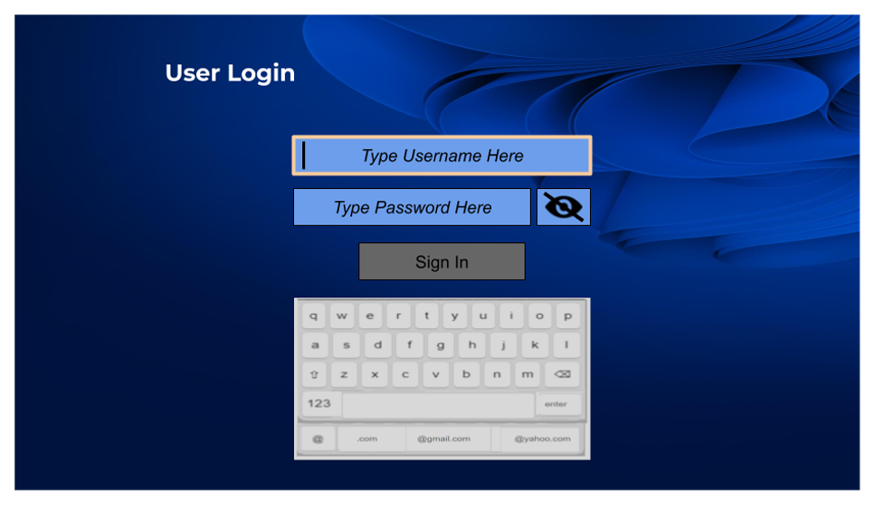

# Oregan Tech Test

## App
The app is deployed and can be viewed here:
https://ivsuleman.github.io/oregan-test

## Run in Local Enviornment
This project was bootstrapped with:
[Create React App](https://github.com/facebook/create-react-app).

### 0. Pre-Requisites

1. Install Node.js
2. Install NPM
3. Install React v18 (to ensure compatibility with the react-simple-keyboard library)

In the project directory, you can run:

### 1. `npm install`

Installs the app and dependent code in your local enviornment

### 2. `npm start`

Runs the app in the development mode.\
Open [http://localhost:3000](http://localhost:3000) to view it in your browser.

## Test Requirements

An UI Input component (text entry box) will be used in various pages of a React-based UX. This component needs to be designed and implemented so that it displays characters entered by an On Screen Keyboard - or potentially another input source.

An example screen that uses 2 instances of this common UI component is shown below:

### Design Considerations

Some example design considerations based on the UX design for the Login page are as follows

- a cursor/caret shown when the UI Input component is focussed.
- ability to show/hide the characters,i.e. for entering a password - where the hide replaces the chars with a '\*'.
- When 'hide' is enabled show the real character for a set period before changing to be a ‘_', the char to ‘hide’ the password characters can be hard coded to '_’.
- The show/hide control is a separate component, whose value will be passed into the UI Input component to control.
- Make a suggestion on whether the cursor shall flash

### Q1 Can you provide additional design considerations for the UI Input component based on the Login Page Design provided that are not mentioned/listed above?

### Q2 Can you implement a React UI Input Component, written in Javascript, which covers the design considerations provided to you, plus the additional design considerations from Q1.

Note that the implementation can be tested using the Chrome browser.

Once the component is created please demonstrate it operating on a test page.

Using an On Screen Keyboard for the test page is optional. If the component can be shown to operate correctly (demonstrating the required functionality), without an On Screen Keyboard that would be acceptable.

Here is a reference keyboard if needed https://github.com/hodgef/react-simple-keyboard

NOTE: THE ‘INPUT’ ELEMENT CANNOT BE USED FOR THIS TEST
